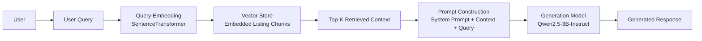

## Paragraph Definition

A paragraph is defined as one complete listing description from the dataset. Since each row in the CSV contains a full 
service or product listing, each row naturally serves as a paragraph-level unit. This approach ensures that paragraph 
boundaries are semantically meaningful and that chunking begins from complete units of text rather than arbitrary text 
fragments.

## Overlap Implementation

Overlap is implemented using a sliding window approach with a window size of 2 paragraphs and a stride of 1 paragraph. 
This means each chunk contains two adjacent paragraphs, and consecutive chunks share one paragraph of overlap. For 
example, Chunk 1 contains Paragraphs 1 and 2, while Chunk 2 contains Paragraphs 2 and 3. This overlap preserves 
continuity and improves retrieval when relevant information spans nearby paragraphs.

## Complete Thought Requirement

To ensure that each chunk represents a complete thought, chunk boundaries are placed only between full paragraphs, 
never inside sentences. In addition, the hybrid chunking strategy groups paragraphs by semantic category so that each 
chunk remains topically coherent and does not merge unrelated content.

## Compare Embedding Models

The large embedding model had large cosine similarity scores the most frequently compared to smaller models having
a much smaller value. The larger models were also better at handling queries that required semantic understanding 
rather than just keyword matching. Generally, the retrieval scores for the large model had higher quality and 
fewer results with hallucinations. However, larger models did not always perform better, when testing queries with 
keyword based matches (for example, calculus tutoring or graduation photos), the small and medium models performed 
just as well as the larger model. The larger model was still the only model that consistently performed well.

## Comparing Chunking Strategies

The Hybrid chunking strategy worked the best for this dataset. Outputs using that strategy had higher quality scores 
whereas the fixed-length chunking performed very poorly for some queries. By grouping the listings by the category, 
the system could ensure that a single service listing was not split in half, ensuring that the context remained whole.
The overlap and hybrid strategy improved the relevant chunk retrieval scores compared to the fixed chunking scores. 
Lastly, the chunking greatly affected the final answers. Fixed chunking typically led to incomplete answers while the 
hybrid retrieval model was better. While it sometimes provided too much text, it did provide the correct details.

## Data Scaling Experiment

As a dataset size increases, the retrieval quality must be able to handle similar yet distinct content. For example, 
finding the difference between types of Photography or beauty services provided. These specifications require having 
higher embedding precision to accurately obtain answers. Noise will also increase as the amount of data increases. 
Larger datasets require better filtering and semantic understanding to ensure LLMs are not distracted by noise or 
irrelevant information.

## Failure Analysis & Improvement
#### Retrieval Failure
Query: "Do any listings offer hair styling or makeup for events?"

Failure Description: The system failed to retrieve the relevant "Hairstylist" listing from the database. Instead, it 
returned chunks related to a "Nail Artist" and a "Photographer" because they shared the "event" context.

This was caused by the Small embedding model’s limited semantic resolution (384 dimensions) combined with Fixed 
Chunking. The fixed strategy likely split the hairstyling description in a way that diluted its primary keywords, 
making it rank lower than other service types.

#### Logic/Context Failure
Query: "Do any listings offer hair styling or makeup for events?"

Failure Description: Although the "Hairstylist" chunk was successfully retrieved at Rank 1, the LLM generated a 
negative response: "No, the provided listings do not offer hairstyling and makeup services together."

This was a Query Formulation and Prompting issue. The LLM interpreted the "and" in the user query too strictly. Because 
no single listing offered both services simultaneously, the model ignored the valid partial match for hairstyling

#### Incomplete Answer
Query: "Who offers graduation photography on campus?"

Failure Description: The LLM identified the correct service but provided a truncated response that ended mid-sentence: 
"...including the Quad, Alma Mater,".

This was a System Parameter failure. The max_new_tokens setting was capped at 60, which was insufficient for the model 
to finish describing the detailed marketplace listings.

### Implemented Fix: Parameter Scaling
To address the truncation and context issues, I increased the max_chars_per_chunk to 500 and the max_new_tokens to 100. 
This allowed the model to receive more complete listing descriptions and provided the necessary "room" to generate full 
responses without cutting off mid-sentence.

#### Before vs. After Comparison

Before Improvement : The response was cut off abruptly due to strict token limits: "A student photographer 
offers graduation photo sessions around popular UIUC landmarks including the Quad, Alma Mater,"

After Improvement: With the expanded limits, the model provided a comprehensive answer: "The UIUC junior in 
engineering offers personalized tutoring in calculus and linear algebra... The sessions are tailored to fit the 
student's syllabus, homework, and exam schedule... They provide customized sessions that align with your course 
materials..."

#### Results of the Change
This adjustment led to a significant improvement in answer quality, with the response length increasing from 
approximately 250 characters to 565 characters. While the system latency increased (from ~11s to ~24s for certain 
queries), the trade-off resulted in much more helpful and semantically complete information for the user.

## Part 4: System Design Reflection

### 4.1 Cost Awareness

Building this RAG system made it clear that cost is not controlled by one single model choice. Instead, it comes from a combination of how many embeddings we create, how large those embeddings are, how much text we retrieve, and how much text the generation model has to process for each question.

In our project, the three embedding models used were:

| Model Size | Model Name | Max Sequence Length | Cost Implication |
|---|---|---:|---|
| Small | `sentence-transformers/all-MiniLM-L6-v2` | 256 | Lowest embedding cost and storage cost |
| Medium | `sentence-transformers/all-mpnet-base-v2` | 384 | Moderate cost with better semantic coverage |
| Large | `BAAI/bge-large-en-v1.5` | 512 | Highest embedding and retrieval cost |

The first major cost factor is **embedding size**. Larger models produce richer semantic representations, which helped in our experiments when the query was phrased less directly. For example, when a user asked about services in a more natural or indirect way, the larger model was more likely to retrieve the right type of listing, while the smaller model sometimes drifted toward related but incorrect results. This matched what we observed earlier in the analysis: the large model generally had stronger retrieval quality and fewer hallucination issues, although it did not always outperform the smaller models on straightforward keyword-like queries such as calculus tutoring or graduation photography. :contentReference[oaicite:0]{index=0}

However, larger embeddings also increase cost in two ways. First, generating them takes more computation. Second, storing and comparing them during retrieval is more expensive because each chunk is represented by a larger vector. On a small dataset like ours, this is manageable, but if Harbor expanded to thousands of listings across campuses, this cost would grow quickly.

The second major cost factor is **chunk size**. Our dataset is structured so that each row is already one complete listing description, and that became our paragraph unit. This was a useful design choice because it kept chunk boundaries meaningful instead of arbitrary. From there, different chunking strategies changed the number and size of chunks that had to be embedded and searched. Fixed chunking can be cheaper to implement, but it performed worse when it split service information in unhelpful ways. The hybrid strategy gave better retrieval because it preserved complete service descriptions and grouped topically related content, but that also means some chunks contain more text and therefore increase prompt size once retrieved. :contentReference[oaicite:1]{index=1}

The third cost factor is **top-k retrieval**. Retrieving more chunks increases the amount of context passed to the generation model. That can improve answer quality if the extra chunks are truly relevant, but it can also increase latency and push irrelevant text into the prompt. In our system, this tradeoff was especially important because the generation model must read the retrieved listings and produce a response grounded in them. If too many chunks are passed in, the model has more tokens to process and more chances to be distracted by nearby but irrelevant services.

A related lesson came from our failure analysis. When we increased parameters such as `max_chars_per_chunk` and `max_new_tokens`, answer completeness improved, but latency also increased noticeably. In one example, the response became much more complete after increasing these limits, but the time for some queries roughly doubled. That result shows that cost is not only monetary or computational in the abstract; it also appears directly as slower user experience. :contentReference[oaicite:2]{index=2}

Overall, the most important cost tradeoff in our system is:

| Design Choice | Benefit | Cost / Risk |
|---|---|---|
| Larger embedding model | Better semantic retrieval, especially for vague queries | More compute and storage |
| Larger chunks | More complete context | More irrelevant text per retrieval |
| Smaller chunks | More precise retrieval targets | More embeddings to store/search |
| Higher top-k | More context for answer generation | Longer prompts, higher latency, more noise |
| Higher output/token limits | More complete answers | Slower responses |

For Harbor, where listings are short and domain-specific, the best design is not simply “use the biggest model.” The better approach is to choose a setup that preserves listing meaning, retrieves only relevant chunks, and gives the generation model enough room to answer fully without overloading it.

---

### 4.2 RAG vs Alternatives

This project also helped show why RAG is a better fit for Harbor than either fine-tuning or pure prompting.

#### Comparison Table

| Approach | What It Does | Strengths | Limitations | When to Use |
|---|---|---|---|---|
| RAG | Retrieves relevant knowledge base chunks and passes them to the LLM at inference time | Updatable, grounded in dataset, no retraining needed | Depends heavily on chunking and retrieval quality | Best when information changes or comes from an external dataset |
| Fine-tuning | Trains the model weights on domain-specific examples | Can adapt model behavior/style deeply | Expensive, harder to update, requires training data | Best when task behavior is stable and repeated at scale |
| Pure Prompting | Uses only the base model and a prompt, without retrieval | Simple and fast to prototype | Cannot access project-specific knowledge reliably | Best for general reasoning tasks without external facts |

For Harbor, **RAG is the most appropriate approach** because the knowledge we want the model to answer from is not general world knowledge. It is a specific marketplace of student-created listings: tutoring, photography, beauty services, fundraisers, and other peer services. The model should not invent what exists on the platform. It should answer based on the actual listings in the dataset.

That requirement makes **pure prompting** a weak option. If we asked the generation model, “What photography services are available?” without retrieval, it could produce a generic answer about the kinds of photography students might offer, but that would not be tied to what is actually in Harbor. For this project, that would be a major problem because correctness depends on the system grounding itself in the available listings.

**Fine-tuning** is also not the right fit here. Harbor listings can change as students add, remove, or update services. If the platform were fine-tuned on old listing data, the model would become stale and would need retraining to stay current. That is both inefficient and unnecessary. The real challenge in this assignment was not teaching the model a new language pattern; it was making sure the model could find the right listing and answer from it.

RAG solves that problem more directly. It lets us keep the generation model fixed while updating only the external knowledge base. This is especially useful for a campus marketplace because service availability is dynamic. A tutor may stop offering sessions, a fundraiser may only be active temporarily, and listings may vary by semester.

At the same time, our experiments also showed that RAG is only as good as its retrieval stage. When the wrong chunk is retrieved, the final answer suffers even if the language model is strong. For example, one of our failure cases occurred when the system retrieved a nail artist and a photographer instead of the hairstylist listing because the smaller embedding model and fixed chunking did not preserve the right semantic signal strongly enough. In another case, the correct chunk was retrieved, but the model still answered incorrectly because it interpreted “hair styling and makeup” too strictly. These examples show that RAG is not automatically correct just because retrieval is present; the entire pipeline still needs careful design. :contentReference[oaicite:3]{index=3}

So for Harbor:

- **RAG** is best because it keeps answers tied to real listings.
- **Fine-tuning** is unnecessary because the knowledge base is small and changeable.
- **Pure prompting** is too unreliable because it lacks access to the actual platform data.

That makes RAG the most practical and maintainable design for this project.

---

### 4.3 System Design

If Harbor were scaled into a real student marketplace used regularly, the system would need to support many daily searches while still returning grounded and relevant responses. The current assignment version already shows the core logic:

**User Query → Query Embedding → Similarity Search over Listing Chunks → Retrieved Context → Qwen2.5-3B-Instruct → Final Response**

A diagram of the system is shown below.

#### System Diagram

```text
User
  ↓
Query
  ↓
Embedding Model
(all-MiniLM-L6-v2 / all-mpnet-base-v2 / bge-large-en-v1.5)
  ↓
Similarity Search over Embedded Harbor Listing Chunks
  ↓
Top Retrieved Context
  ↓
Prompt Construction
(System Instruction + Retrieved Context + User Query)
  ↓
Generation Model
(Qwen/Qwen2.5-3B-Instruct)
  ↓
Response
```

### System Architecture Diagram



### Scaling the System to 10K Users per Day

If Harbor were deployed as a real platform serving approximately **10,000 users per day**, several optimizations would be necessary to maintain efficiency and low latency.

#### Precomputing Embeddings

Embeddings for marketplace listings should be computed once when listings are added or updated. These embeddings would then be stored in a vector database. At query time, only the user query embedding needs to be generated. This significantly reduces computational overhead because the system avoids recomputing embeddings for static content.

#### Vector Database Optimization

Similarity search becomes more expensive as the dataset grows. For large numbers of listings, a production system would store embeddings in a dedicated vector database such as:

- FAISS
- Pinecone
- Weaviate

These systems use Approximate Nearest Neighbor (ANN) search to quickly retrieve relevant vectors without comparing against every embedding in the dataset.

#### Retrieval Filtering

Marketplace listings fall into categories such as tutoring, photography, services, and fundraisers. If the dataset grows, the system could use category-based filtering before similarity search. This would reduce noise and improve retrieval precision when users submit broad queries.

#### Prompt Size Control

Another important optimization is limiting prompt size. If too many chunks are inserted into the prompt, the language model must process more tokens, which increases inference time and may introduce irrelevant context.

A practical solution is keeping **top-k retrieval relatively small** while ensuring that retrieved chunks are highly relevant.

#### Handling Listing Updates

Because Harbor listings can change frequently, the system must handle updates efficiently. Instead of retraining models, new listings would simply be embedded and inserted into the vector store, while outdated listings would be removed. This design allows the knowledge base to evolve without modifying the generation model.

### Design Priorities for a Production Harbor System

| Priority | Optimization | Reason |
|---|---|---|
| 1 | Precompute listing embeddings | Avoid repeated computation |
| 2 | Use optimized vector search | Ensure fast retrieval at scale |
| 3 | Preserve semantic chunk boundaries | Improve retrieval accuracy |
| 4 | Limit prompt size | Reduce latency |
| 5 | Re-embed only changed listings | Keep knowledge base up to date |

### Reflection

Through this project we learned that building an effective RAG system involves more than simply connecting a language model to a dataset. The design of the retrieval pipeline strongly influences the quality of the final responses.

Choices such as chunk boundaries, embedding model size, and retrieval parameters can significantly affect whether the model produces useful answers or incorrect ones. In the Harbor system, preserving listing-level meaning and retrieving the most relevant chunks were critical for generating grounded responses.

As the system scales, maintaining a balance between **semantic accuracy, computational efficiency, and response latency** becomes the key design challenge.


